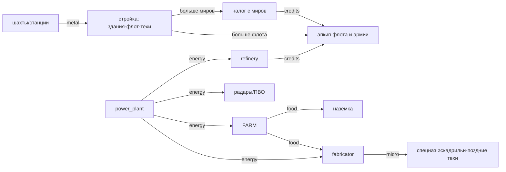

# Сессионная ресурсная экономика — как есть + дизайн

> **Слой:** внутриматчевые ресурсы (бар вверху экрана). Мета-слой — Суверены ◆,
> аукцион, Варранты — живёт отдельно в `economy-roadmap.md` и здесь не трогается.
> **Статус:** модель «как есть» сверена с кодом (main `b300466`, прототипный бандл
> `prototype/src/game.ts` — то, во что реально играют); предложения — кирпичи ECON-1…6.

## 1. Модель как есть (сверено с кодом)

Пять ресурсов: **credits · metal · food · energy · microelectronics**.
Стартовый пакет места: `credits 260 · metal 320 · food 120 · energy 90 · micro 40`.

Механика начисления (economy.ts): спановая, `ставка × Δt` каждый `time.advanced`;
ставка мира = сумма `produces` зданий × богатство мира (`planetType.productionBonus`,
от −25% barren до +45% crystalline) × бонусы фракции/техов (хук `economy.production`),
поверх — гражданский налог. Апкип списывается посуточно; **неуплата не уводит в минус**:
казна клампится в 0, ресурс попадает в `arrears`, и в следующий спан все *производящие*
здания, чей апкип назван в arrears, работают на 50% (**BROWNOUT**). Бомбардировка
замораживает выпуск мира целиком. Стройка ≥50% прогресса уже частично производит.

### Краны (в час, L1/L2/L3)

| Ресурс | Источник | Ставка | Апкип источника |
|---|---|---|---|
| metal | mine (80m) | 12 / 18 / 27 | — |
| metal | metal_station (80m+30c, мёртвые миры) | 30 / 60 / 100 | energy 8 |
| credits | **гражданский налог** (сам по себе) | 100/ч за 1-й обитаемый мир, n-й даёт `100/(1+0.06(n−1))` | — |
| credits | refinery (110m) | 8 | energy 8 |
| credits | tax_office (120m+60c) | ×1.25 к кредитному доходу мира | — |
| food | farm (90m) | 10 / 16 / 24 | energy 6 |
| energy | power_plant (110m+30c) | 14 / 26 / 42 | credits 6 |
| micro | fabricator (180m+100c) | 5 / 11 / 19 | **energy 30 + food 8** |

### Стоки

- **Стройка** — единственный сток metal: здания, корабли (cruiser 60m+20c …
  strike_carrier 320m+160c), техи (120–500c + 80–380m, поздние + 5–60 micro).
- **Апкип юнитов** (в сутки): credits у всех (scout 1 … carrier 12), **food только у
  наземки** (militia/infantry 1, tank 2).
- **Апкип зданий**: energy (radar 6, orbital_aa 6, farm 6, metal_station 8,
  fabricator 30), credits (power_plant 6).
- **Шпионаж** — 150 credits за попытку.
- **Рынок** — p2p-книга (metal/food/energy/micro за credits), эскроу честный,
  **комиссии нет** → ничего не сжигает, только перераспределяет.
- **Ремонт кораблей** у spaceport — **бесплатный**, 5% корпуса в час на стоянке.

### Петли

Ядро петли честное: экспансия → больше налога → больше армии → больше апкипа, и налог
с убыванием (−6% за мир) душит снежный ком. Energy — внутренний «клей» зданий; micro —
гейт хайтека; food — армейский счёт.

## 2. Находки (дыры, проверено кодом)

- **Д1 · Голод и блэкаут ничего не выключают.** BROWNOUT умножает только `produces` —
  а у радара, ПВО, фортов `produces` пуст. Энергодефицит **никак** не наказывает радары
  и ПВО (апкип платится, за неуплату — ничего). Армия без еды и жалованья не голодает:
  food-дефицит бьёт единственного потребителя с выпуском — fabricator. Напряжения нет.
- **Д2 · Ножницы metal/credits.** Приток metal масштабируется мирами и уровнями шахт,
  стоки — разовые (стройка), ремонт бесплатный → к мид-гейму склад metal пухнет.
  Credits наоборот в вечном дефиците: апкип ест постоянно, налог с убыванием (в
  плейтесте казны не хватало даже на шпионаж). Игрок сидит на горе железа без денег.
- **Д3 · Рынок не работает как рынок.** Продавать food/energy почти незачем (апкипы
  микроскопические, дефицит не болит — см. Д1), комиссии нет (не сток), боты не
  торгуют — книга пустует.
- **Д4 · Рассинхрон данных.** Прототипный `data.resources = ['credits','metal']` при
  пяти реально текущих (core-рынок с таким списком отверг бы food/energy/micro —
  прототип спасает свой `MARKET_GOODS`). Канонический `data/*.json` расходится с
  играбельным бандлом и составом (нет refinery/tax_office/farm — **нет источника
  credits вообще**), и цифрами (cruiser 220m против играбельных 60m).
- **Д5 · Энергия без решений.** Игрок всегда строит power_plant ровно под сумму
  апкипов — ни дилемм, ни торговли, ни рисков. Ресурс есть, игры вокруг него нет.

## 3. Предложения — кирпичи ECON (1 кирпич ≈ 1 PR)

- **ECON-1 · Голодная армия** `[proto]` — S. Food в `arrears` владельца → его наземка
  бьёт на **−25%** (вклад в хук `combat.damage`, читает `player.arrears` — модуль, ядро
  не трогаем) + иконка 🍽 у флотов с десантом и в панели. Еда становится военным
  ресурсом: сжечь фермы врага перед вторжением — осмысленная операция.
  **Готово, когда:** тест «armija в food-arrears теряет 25% урона», иконка на скрине.
- **ECON-2 · Блэкаут** `[proto]` — S. Energy в `arrears` → радиусы радаров **×0.5** и
  урон ПВО **×0.5** у этого владельца (visibility/orbital читают `arrears` из state) +
  затемнение колец радаров на карте. Диверсия по энергосети выключает врагу глаза.
  **Готово, когда:** тест на оба штрафа + визуал.
- **ECON-3 · Ножницы: metal-сток и credits-кран** `[proto]` — M. Два симметричных
  винта: (а) **экспресс-ремонт за metal** — мгновенно дочинить флот по цене
  `1 metal / 2 hp` кнопкой у spaceport (медленный бесплатный остаётся); (б)
  **переплавка** — metal_station/refinery получают заказ «плавить metal → credits»
  (курс ~4:1, хуже рынка — пол, а не замена торговли). Гора железа обретает выход,
  казна — второй кран, управляемый игроком.
  **Готово, когда:** оба заказа в панели мира, тесты на курс/клампы.
- **ECON-4 · Рыночная комиссия 5%** `[proto]` — S. Продавец получает 95%, 5% сгорает —
  первый настоящий сток credits в торговле + анти-спам книги. UI показывает «к
  получению». **Готово, когда:** тест на комиссию, лента лотов показывает net.
- **ECON-5 · Синк данных** `[core][data]` — M. `resources` = все 5 в обоих бандлах;
  канонический `data/*.json` выравнивается с играбельным (перенести refinery /
  tax_office / farm, привести цифры к прототипным) — иначе Stage-3 сервер живёт в
  другой экономике, чем плейтест. **Готово, когда:** оба бандла проходят один и тот же
  экономический smoke-тест (окупаемости из §4 ±20%).
- **ECON-6 · Экономические метрики** `[srv]` — S. В metrics-стек — почасовой срез по
  игроку: приток/отток каждого ресурса, размер казны, arrears-часы. Следующие витки
  баланса крутим по данным плейтестов, а не на глаз.
  **Готово, когда:** JSONL-лог пишет срез, сводка на выходе показывает кривые.

Порядок: **ECON-1 → ECON-2** (дешёвые, сразу дают «зубы» еде и энергии) →
**ECON-3 → ECON-4** (ножницы) → **ECON-6** (замер) → **ECON-5** (синк перед Stage-3).

## 4. Балансовая рамка (окупаемость, для проверки цифр)

| Вложение | Отдача | Окупаемость |
|---|---|---|
| mine L1 (80m) | 12 m/ч | ~6.7 ч |
| mine L2 (+140m) | +6 m/ч | ~23 ч |
| metal_station L1 (80m+30c) | 30 m/ч | ~2.7 ч (риск: мёртвый мир на отшибе) |
| refinery (110m) | 8 c/ч − 8 energy | ~14 ч⁺ (плюс доля power_plant) |
| power_plant L1 (110m+30c) | 14 e/ч − 6 c/сут | окупается только потребителями |
| fabricator L1 (180m+100c) | 5 micro/ч − 30 e − 8 food | самое дорогое содержание в игре |
| tax_office (120m+60c) | +25% credits мира | ~зависит от мира; на столице — часы |

Правило большого пальца, которое держим при любой правке цифр: **здание-кран окупается
за 3–8 часов реального времени** (сессия живёт днями), станции на мёртвых мирах —
быстрее, но дальше и уязвимее; **содержание hi-tech ≥ ⅓ его выпуска в эквиваленте** —
чтобы отключение снабжения врагом было ударом.

## 5. Чего сознательно НЕ делаем

- **Не добавляем шестой ресурс.** Пять уже дают все нужные оси (стройка / содержание /
  армия / инфраструктура / хайтек); новые оси — это данные внутри существующих.
- **Не делаем минусовые балансы.** Кламп в 0 + arrears + штрафы (ECON-1/2) честнее
  долговой спирали и уже реализован детерминированно.
- **Не превращаем рынок в NPC-магазин.** Переплавка (ECON-3б) — пол цены, а не
  бесконечный обменник; торговля людьми остаётся главным курсом.
- **Ядро не трогаем**: все кирпичи — модули/данные/хуки (инвариант №3), детерминизм и
  спановое начисление не меняются.
